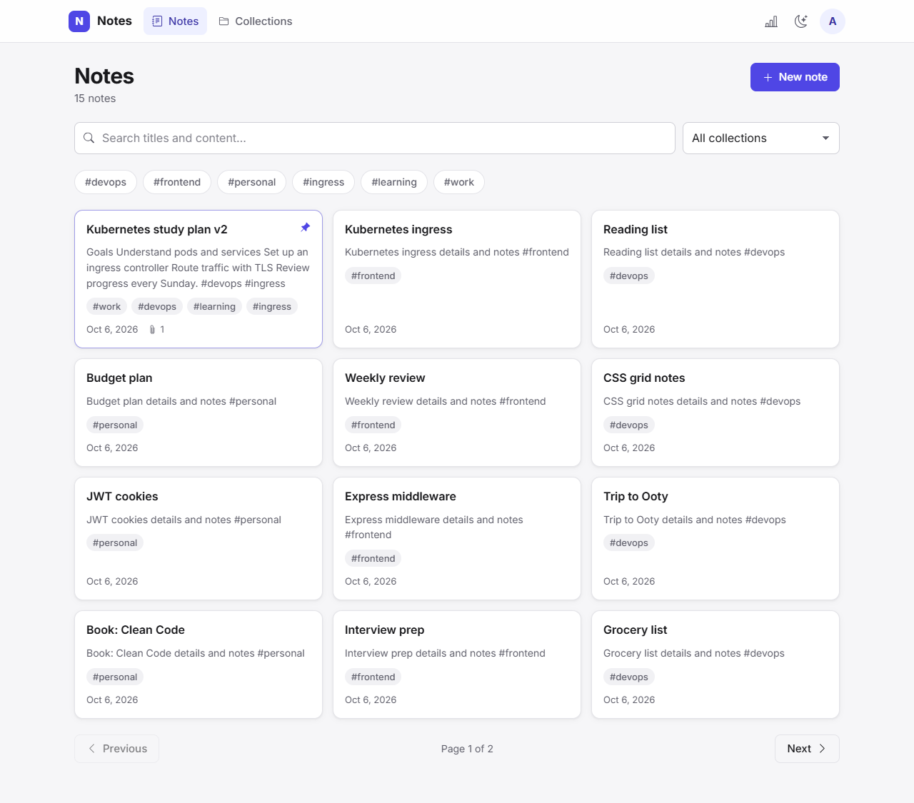
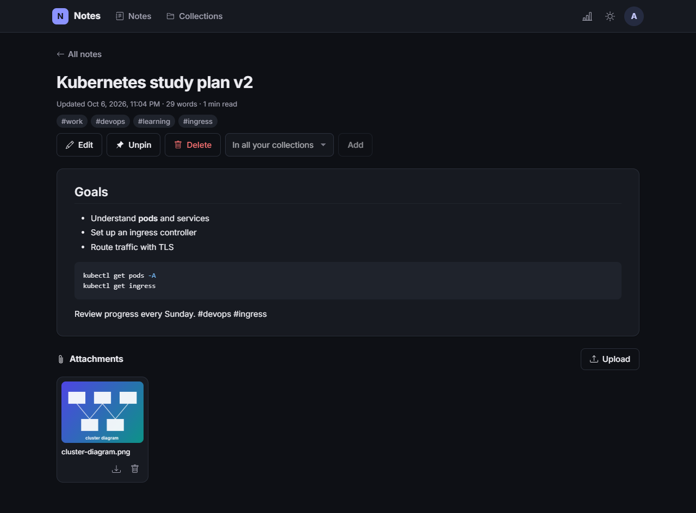
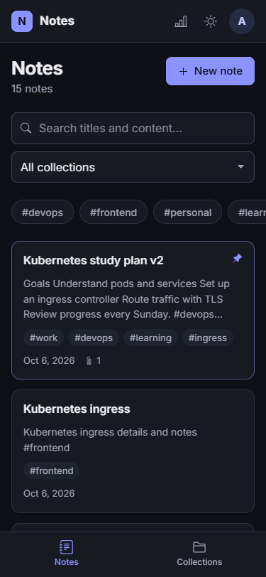
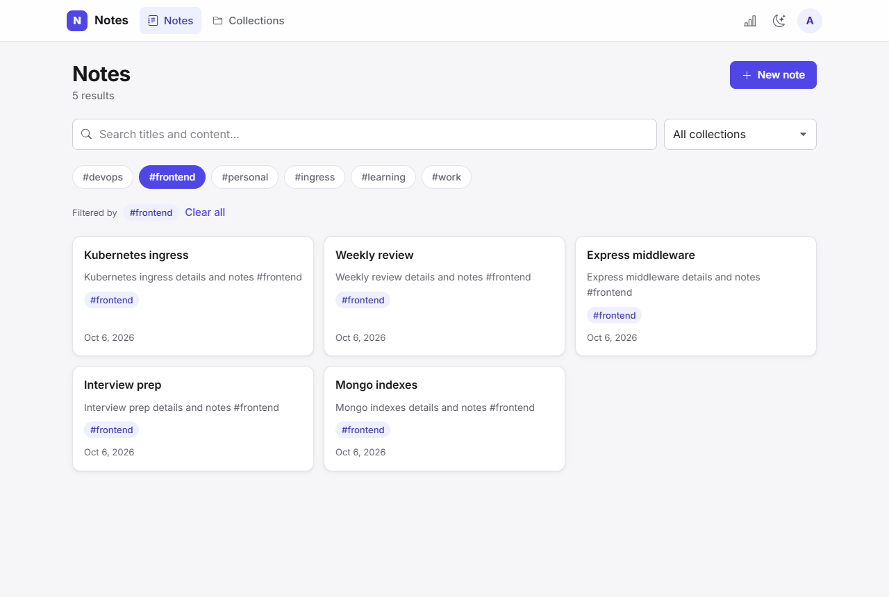
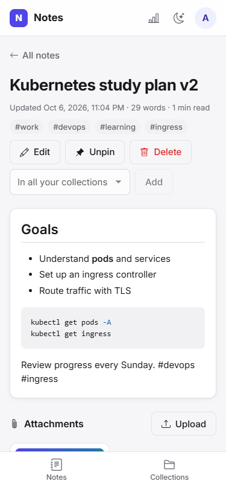
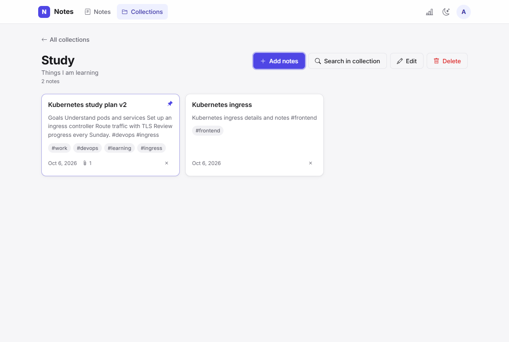
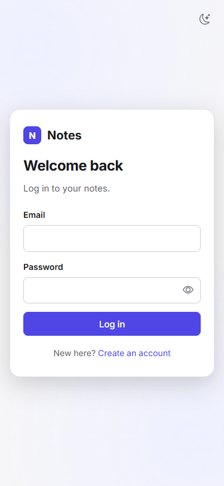
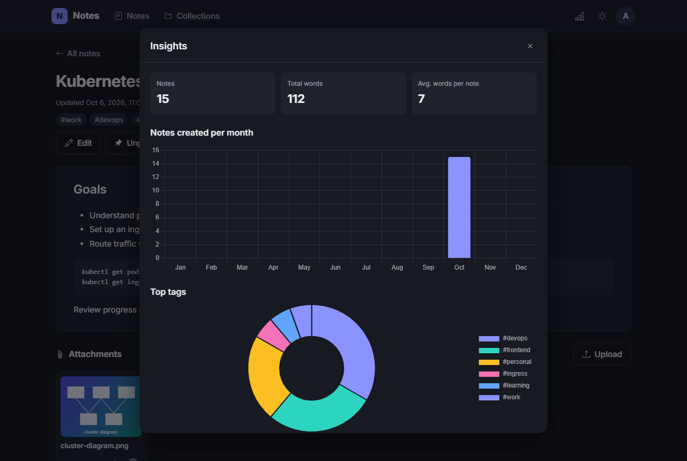

# Notes App

A full-stack MERN notes app with private accounts, MongoDB full-text search, collections, file attachments and markdown, built and tested as a portfolio project.



## Overview

Each user signs up, writes markdown notes, groups them into collections, attaches files, and finds them again with server-side search. Every note, collection and attachment belongs to one user, and the API enforces that on every request.

- **Frontend:** React 19 + Vite, hosted on Vercel
- **Backend:** Express 5 + Mongoose 8 on MongoDB, hosted on Render
- **Quality:** 171 backend integration tests against a real (in-memory) MongoDB, run in GitHub Actions

## Features

- Registration and login with **bcrypt**-hashed passwords
- **JWT in an httpOnly cookie**: the token is never exposed to JavaScript
- **User-owned** notes, collections and attachments; other users' resources return **404**
- **MongoDB text search** over title and content, ranked by relevance (title weighted 5×)
- **Tag** and **collection** filters that combine with search
- **Pagination** with a capped page size (max 50)
- **File attachments** (images, PDF, TXT, DOC, DOCX, up to 5 MB), served only to the owner
- **Hashtag auto-tagging**: `#idea` in the content becomes the tag `idea`
- Markdown editor and sanitised markdown preview, pinned notes, insights charts
- Responsive UI (phone, tablet, desktop) with **dark mode**
- **Zod** request validation and one **consistent JSON error format**
- Login **rate limiting** and security headers (helmet)
- **Automated tests**: Vitest + Supertest + mongodb-memory-server

## Tech stack

| Layer | Used |
| --- | --- |
| Frontend | React 19, React Router 7, Vite 6, axios, @uiw/react-md-editor, rehype-sanitize, Chart.js, react-icons |
| Backend | Node.js, Express 5, Mongoose 8, MongoDB, Multer, Zod, bcrypt, jsonwebtoken, cookie-parser, cors, helmet, express-rate-limit |
| Testing | Vitest, Supertest, mongodb-memory-server, @vitest/coverage-v8 |
| CI / hosting | GitHub Actions, Vercel (client), Render (API) |

## Architecture

```
Browser (React)
   │  same-origin /api/* requests, auth cookie attached automatically
   ▼
Vercel ── rewrite /api/* ──► Express API (Render)
                                │
                                ├─ helmet, CORS, JSON body (1 MB), cookie-parser
                                ├─ requireAuth        verify JWT cookie → req.user
                                ├─ validate (Zod)     body / query / params → req.valid
                                ├─ loadOwnedNote      find { _id, owner: req.user.id } or 404
                                ├─ controllers        business logic
                                └─ errorHandler       one JSON error shape
                                │
                                ▼
                           Mongoose models (User, Note, Collection)
                                │
                                ▼
                             MongoDB
```

```
client/src
  api/          axios instance + one module per resource
  contexts/     auth, theme, toast providers
  components/   layout, ui primitives, notes, stats
  pages/        Notes, NoteDetail, Collections, CollectionDetail, Auth

server/
  app.js        Express app (imported by tests)
  index.js      connects to MongoDB and starts the server
  routes/ controllers/ middleware/ models/ validation/ utils/
  scripts/      assignOwner.js (migration), benchmarkSearch.js
  tests/        integration tests
```

## Authentication

```
Register ─► Zod validates email + password (8 chars to 72 bytes)
         ─► bcrypt.hash(password, 12) ─► MongoDB stores { email, passwordHash }

Login    ─► find user by email ─► bcrypt.compare
         ─► jwt.sign({ sub: userId }, JWT_SECRET, HS256, 7 days)
         ─► Set-Cookie: token=…; HttpOnly; SameSite=Lax; Secure (production)

Request  ─► browser sends the cookie ─► requireAuth verifies it
         ─► loads the user ─► req.user ─► every query filters by owner
```

- The JWT is only ever in the cookie, never in a response body or localStorage.
- Logout clears the cookie. A token for a deleted user, an expired token, or a token signed with another secret is rejected with 401.
- The React app learns who is signed in from `GET /api/auth/me`.
- **Cookies across Vercel and Render:** the client calls `/api` on its own origin and Vercel forwards those requests to Render (`client/vercel.json`). The cookie is therefore first-party and works with `SameSite=Lax`, including in browsers that block third-party cookies. In development, Vite proxies `/api` the same way.

## Search

`GET /api/notes/search?q=&tag=&collection=&page=&limit=`

- **Text index:** `{ owner: 1, title: 'text', content: 'text' }`, with title matches weighted 5× over content.
  - Because `owner` is the index prefix, MongoDB *requires* every text query to match a single owner, so a search can only ever see one user's notes.
- **Filters:** `q` (`$text`), `tag` (exact), and `collection` (must be one of the caller's collections, otherwise 404). All filters are optional and combine with AND.
- **Sorting:** by relevance when `q` is given; otherwise pinned first, then newest. `_id` is the tie-breaker, so pages never overlap.
- **Pagination:** `page` (1–10000) and `limit` (1–50, default 10). The response is `{ results, page, limit, total, totalPages }`, and invalid values return 400.
- **Browse indexes:** `{ owner, pinned, updatedAt, _id }` and `{ owner, tags, … }` let browsing and tag filters read just one page from the index.
- **What `$text` supports:** case-insensitive matching, English stemming ("deploy" finds "deployments"), "exact phrases" and `-excluded` words.
- **What it doesn't:** prefix matches ("kube" does not find "kubernetes"). The UI says so in its no-results state.

## Security

- **Passwords:** bcrypt (cost 12). Plaintext is never stored or logged. Login gives the same response for an unknown email and a wrong password, and runs a dummy bcrypt comparison so the timing is similar too. Registration does reveal that an email is taken (409), as most sign-up forms do.
- **Session:** a JWT (HS256, 7 days) in an `HttpOnly`, `SameSite=Lax` cookie, `Secure` in production. `JWT_SECRET` is required and must be at least 32 characters in production.
- **Ownership:** every query includes `owner: req.user.id`, taken from the verified token and never from the request. Another user's note, collection or attachment returns **404, not 403**, so IDs can't be probed.
- **Mass assignment:** Zod schemas strip unknown fields, so `owner`, `mediaFiles`, `pinned` and similar fields can't be set through create or update.
- **Validation:** every body, query and path parameter goes through a Zod schema. Values are checked as strings or ObjectIds before they reach MongoDB, so a query operator like `{"$ne": null}` is rejected.
- **Uploads:**
  - 5 MB limit, one file per request, and an extension *and* MIME type allowlist.
  - Files are stored under random names.
  - They're served only through an owner-checked route, with `nosniff`. Non-image and non-PDF types are sent as downloads.
  - Stored paths are reduced to a base name, which blocks path traversal.
- **Errors:** one handler returns `{ success: false, error: { code, message, details? } }`. Unexpected errors are logged on the server; the client sees a generic message with no stack trace.
- **Abuse limits:** 10 failed logins per email per 15 minutes; JSON bodies capped at 1 MB; page size capped at 50.
- **Headers and CORS:** helmet headers; CORS limited to `CLIENT_ORIGIN` with credentials.
- **Dependencies:** `npm audit --omit=dev` reports 0 known vulnerabilities in server or client production dependencies (checked 2026-10-06).

## Testing

```bash
cd server
npm test               # 171 tests
npm run test:coverage  # with v8 coverage
```

- Tests import the real Express app (`app.js`) and send real HTTP requests with Supertest.
- `mongodb-memory-server` starts a throwaway MongoDB once per run. Each test file gets its own database, and collections are cleared after every test. No local MongoDB is needed.
- Assertions check the status code, the response body, and the database or disk state.

| File | Covers |
| --- | --- |
| `auth.test.js` | register, duplicates, hashing, login, cookie flags, forged/expired/`alg:none` tokens, logout |
| `ownership.test.js` | two users: notes, collections, attachments; 404 for foreign resources; legacy-data migration |
| `crud.test.js` | every notes and collections endpoint, stats |
| `search.test.js` | text, stemming, phrases, ranking, tag/collection/combined filters, pagination, isolation, query plans |
| `validation.test.js` | invalid bodies, params and uploads; nothing written on failure |
| `errors.test.js` | unified error shape, 404 routes, 413, 500 without leaks |
| `attachments.test.js` | upload, download headers, missing files, path traversal, delete |
| `hashtags.test.js` | auto-tagging on create and update |
| `security.test.js` | login rate limiting, security headers |

CI (`.github/workflows/ci.yml`) runs the server tests with coverage, plus the client lint and build, on pushes to `main` and `feature/**` branches and on pull requests.

## Setup

**Requirements:** Node.js 20+ and a MongoDB connection string (local MongoDB or Atlas).

```bash
git clone https://github.com/Ramprasanth7119/notes_app.git
cd notes_app

# API
cd server
npm install
cp .env.example .env      # then set MONGO_URI and JWT_SECRET
npm run dev               # http://localhost:5000 (npm start in production)

# Client (second terminal)
cd client
npm install
npm run dev               # http://localhost:5173, proxies /api to :5000
```

Other scripts:

| Command | What it does |
| --- | --- |
| `server: npm test` / `npm run test:coverage` | integration tests (+ coverage) |
| `server: npm run bench:search` | local search benchmark (see `PROJECT_METRICS.md`) |
| `server: npm run migrate:assign-owner -- --email you@example.com [--apply]` | assign pre-auth notes and collections to one account (dry run without `--apply`) |
| `client: npm run lint` / `npm run build` | ESLint / production build |

## Environment variables

Server (`server/.env`, see `server/.env.example`):

| Variable | Required | Default | Purpose |
| --- | --- | --- | --- |
| `MONGO_URI` | yes | — | MongoDB connection string |
| `JWT_SECRET` | yes | — | signs session tokens; at least 32 characters in production |
| `NODE_ENV` | no | — | `production` enables the `Secure` cookie flag and the secret-length check |
| `CLIENT_ORIGIN` | no | `http://localhost:5173` | allowed CORS origin(s), comma-separated |
| `COOKIE_SAMESITE` | no | `lax` | `lax`, `strict` or `none` (`none` forces `Secure`) |
| `SESSION_DAYS` | no | `7` | JWT and cookie lifetime |
| `BCRYPT_SALT_ROUNDS` | no | `12` | bcrypt cost |
| `UPLOAD_DIR` | no | `server/uploads` | where attachments are stored |

Client (optional): `VITE_API_URL` points the client at an API on another origin. It's unset by default, which means same-origin `/api`. If you set it, you'll need `COOKIE_SAMESITE=none`.

## API

All endpoints except register, login and logout require the auth cookie. Errors use `{ success: false, error: { code, message, details? } }`.

| Method | Path | Description |
| --- | --- | --- |
| POST | `/api/auth/register` | create account, sets cookie |
| POST | `/api/auth/login` | log in, sets cookie (rate-limited) |
| POST | `/api/auth/logout` | clear cookie |
| GET | `/api/auth/me` | current user |
| GET | `/api/notes/search` | search / filter / paginate notes |
| GET | `/api/notes` | all of the user's notes |
| POST | `/api/notes` | create note (auto-tags hashtags) |
| GET | `/api/notes/:id` | one note |
| PUT | `/api/notes/:id` | update title, content, tags |
| DELETE | `/api/notes/:id` | delete note and its files |
| PATCH | `/api/notes/:id/pin` | toggle pinned |
| GET | `/api/notes/stats` | monthly, tag and word statistics |
| GET | `/api/notes/month/:month` | notes for a month name |
| GET | `/api/notes/date/:date` | note for a `YYYY-MM-DD` date |
| POST | `/api/notes/:id/upload` | upload one attachment (`media` field) |
| GET | `/api/notes/:id/files/:fileId` | download an attachment |
| DELETE | `/api/notes/:id/files/:fileId` | delete an attachment |
| GET | `/api/collections` | list collections (with notes) |
| POST | `/api/collections` | create collection |
| GET | `/api/collections/:id` | one collection |
| PUT | `/api/collections/:id` | rename / change description |
| DELETE | `/api/collections/:id` | delete collection (notes are kept) |
| POST | `/api/collections/:id/notes` | add a note (`{ noteId }`) |
| DELETE | `/api/collections/:id/notes/:noteId` | remove a note |

Total: 24 endpoints (4 auth, 13 notes, 7 collections).

## Screenshots

Captured from the app running locally with demo data.

| Desktop | Mobile |
| --- | --- |
|  |  |
|  |  |
|  |  |
|  | |

## Deployment

| Part | Host | What the repository expects |
| --- | --- | --- |
| Client | Vercel ([notes-app-rho-hazel.vercel.app](https://notes-app-rho-hazel.vercel.app)) | Vite project in `client/` (`npm run build` → `dist/`). `client/vercel.json` forwards `/api/*` to Render and serves `index.html` for app routes such as `/collections`. |
| API | Render (`notes-cw4m.onrender.com`) | Node service in `server/`: install with `npm install`, start with `npm start` (`node index.js`). |

Render environment variables: `MONGO_URI`, `JWT_SECRET` (at least 32 random characters), `NODE_ENV=production`, `CLIENT_ORIGIN=https://notes-app-rho-hazel.vercel.app`.

Notes:
- **Existing data:** notes and collections created before authentication have no owner, so nobody sees them until they're assigned. After registering, run `npm run migrate:assign-owner -- --email you@example.com --apply` against the production database.
- **Free-tier sleep:** the Render instance sleeps when idle, so the first request can take up to a minute. The UI shows a "server may be waking up" message.
- **Ephemeral disk:** Render's free-tier disk doesn't persist across deploys or restarts, so attachments can disappear. The API then answers 404 for the missing file. Persistent storage (a Render disk or object storage) would fix this.
